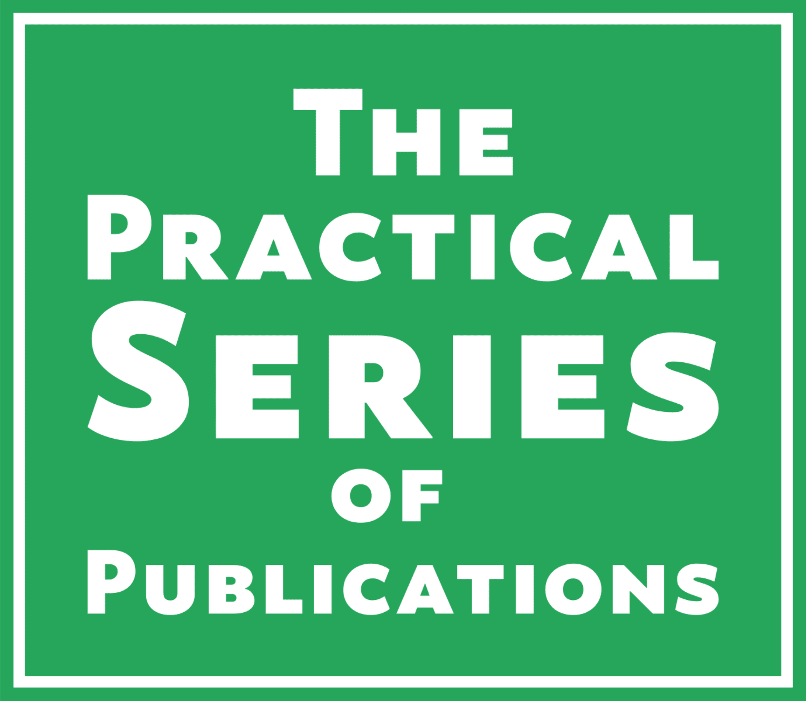

# &copy; Practical Series of Publications

###### A series of technical documents for engineers (and others)

# Global Administration of the PS Website

<p align="center">
    
</p>
This repository contains the administrative summary of the Practical Series of Publications website and a full list of all the publications within it.

## Contents

The Practical Series of Publications is a website containing various resources for engineers; specifically those engineers specialising in the use of *Siemens Simatic control systems*.

The website also contains publications of a more general nature: *Using the Git Version Control System from within the Brackets text editor* and a *Website Development Template*.

This repository is the administrative section of the Practical Series of Publications; it shows the organisation of the whole website structure and indexes the current publications.

Currently there are the following publications and repositories:

1.  PS0001-practicalseries-admin (this repository)
2.	PS1000-practicalseries-main-page
3.	PS1001-website-development-template
4.	PS1002-brackets-git-and-github-vcs
5.  PS9901-fairfax-wtw-fds

## The website structure

Each publication in the Practical Series of Publications has a designated four digit project number in the following format:

```PSXXXX```

The four digits ```XXXX``` determine what type of publication the project represents. The following are the broad categories represented by this number:


| Project Number    | Purpose
| ----------------- | --------------------------------------
| ```PS0001```      | Global Administration
| ```PS0002-0499``` | Reserved
| ```PS0500```      | Live website (complete offline copy)
| ```PS0501-0599``` | Reserved for minimised versions of site
| ```PS0600-0999``` | Reserved
| ```PS1000```      | PS Main (landing) page
| ```PS1001-1999``` | General (non-engineering) publications
| ```PS2000-2999``` | PLC based engineering publications
| ```PS3000-3999``` | SCADA & HMI engineering publications
| ```PS4000-4999``` | DCS based engineering publications
| ```PS5000-5999``` | Free
| ```PS6000-6999``` | Free
| ```PS7000-7999``` | Free
| ```PS8000-8999``` | Free
| ```PS9000-9999``` | Supporting documents

With the website itself, each publication is contained within its own folder and that folder begins with the four digit number specified above. For example, the Brackets-Git and GitHub website has the project designation ```PS1002``` and it has the following path:

```../1002-vcs```

## Project index

The following is a register of the Practical Series of Publication and associated project numbers:

| Project Number    | Description                                 | Internal or <br> Publishable | Status
| ----------------- | ------------------------------------------- | ---------------------------- | ------
| ```PS0001```      | Global Administration                       | Int                          | Live document
| ```PS0500```      | PS Live Website (complete offline website)  | Pub                          | Live website
| ```PS1000```      | PS Main (landing) page                      | Pub                          | P11-published
| ```PS1001```      | PS Website Template publication             | Pub                          | P10-part published
| ```PS1002```      | PS Brackets-Git and GitHub publication      | Pub                          | P15-published
| ```PS2001```      | PS Automation Library                       | Pub                          | Planned
| ```PS4001```      | PS PCS7 Automation                          | Pub                          | Planned
| ```PS9901```      | Fairfax WTW Functional Design Specification | Pub                          | D00-development
